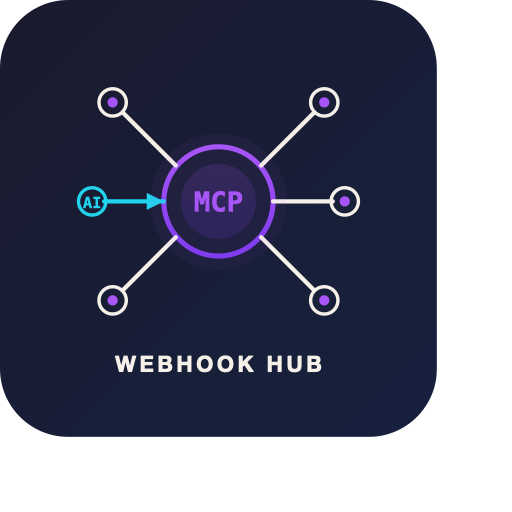
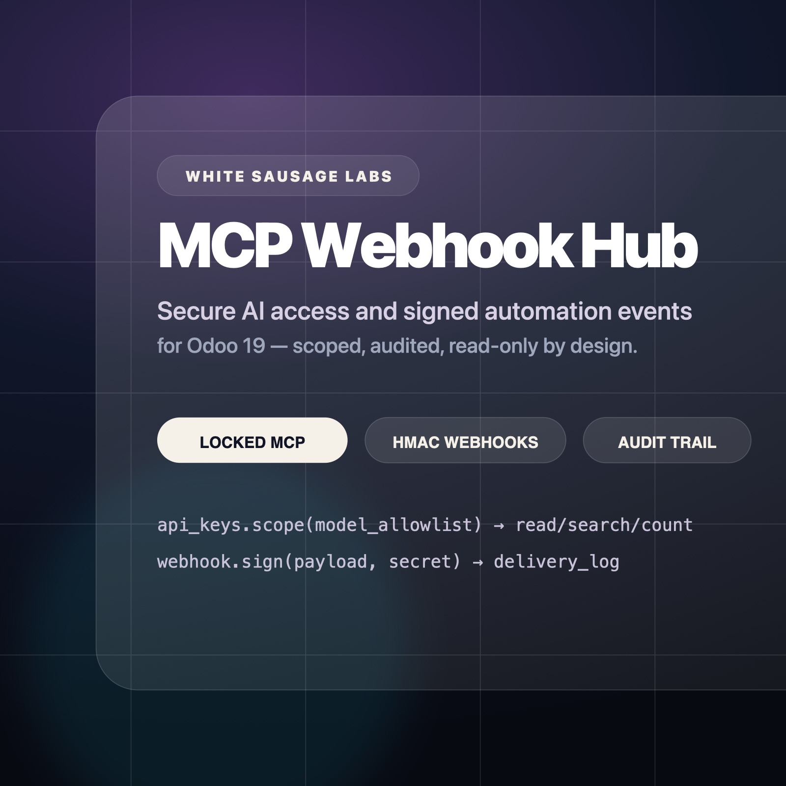
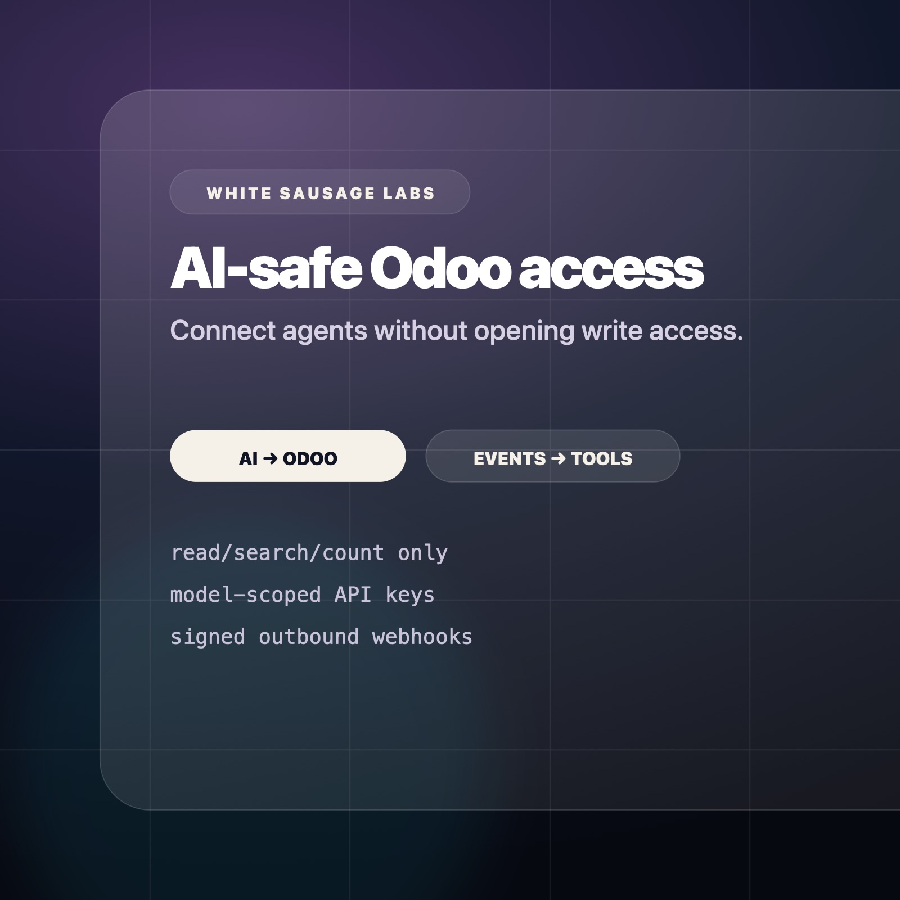
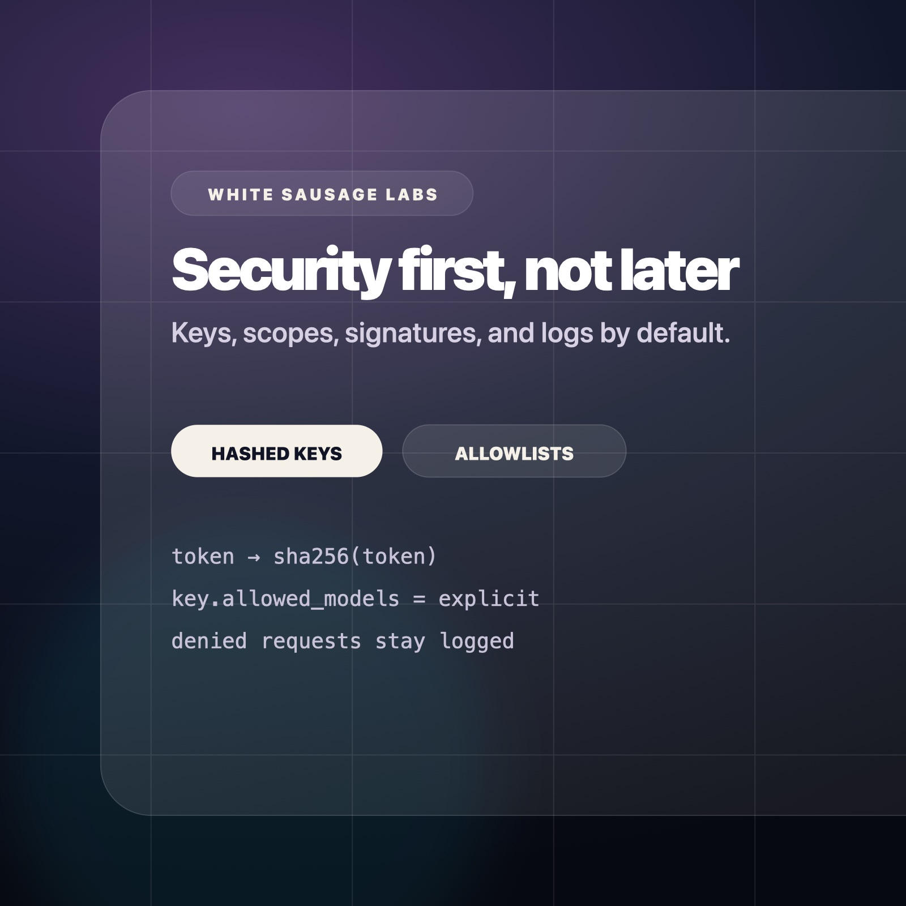
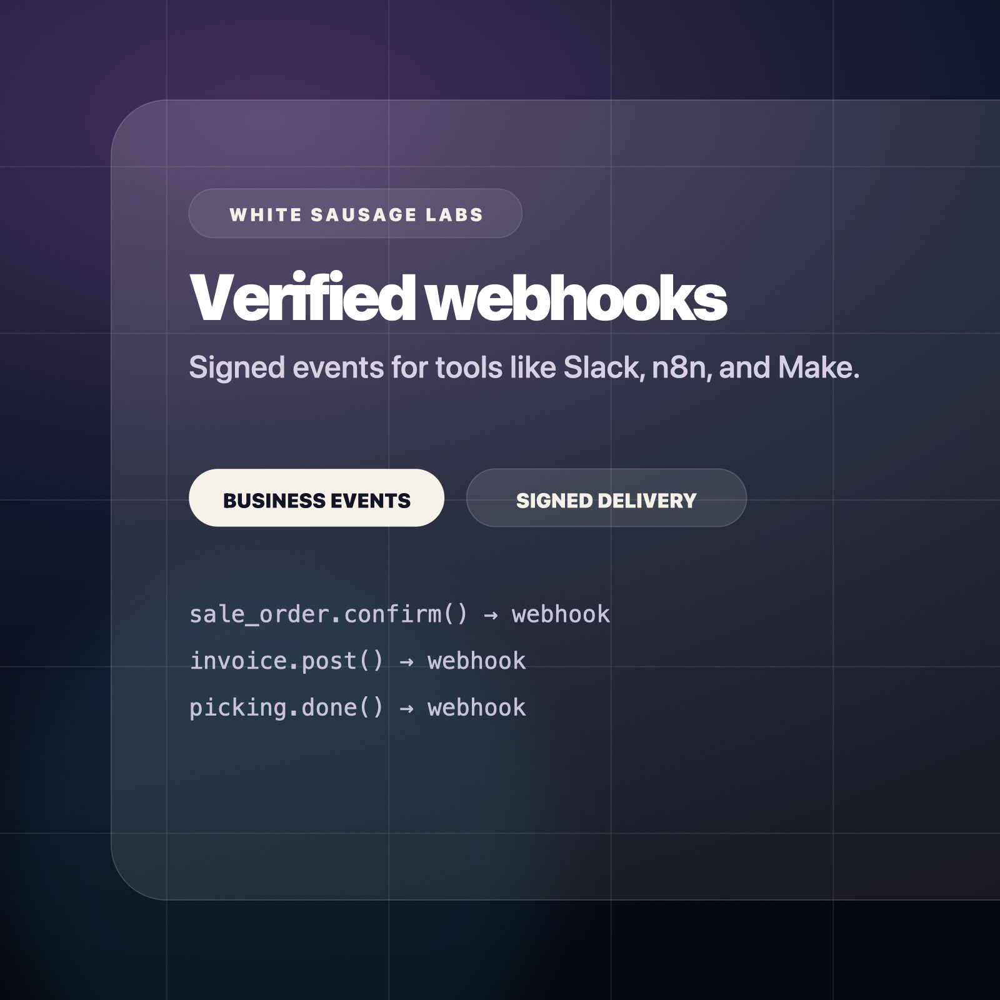
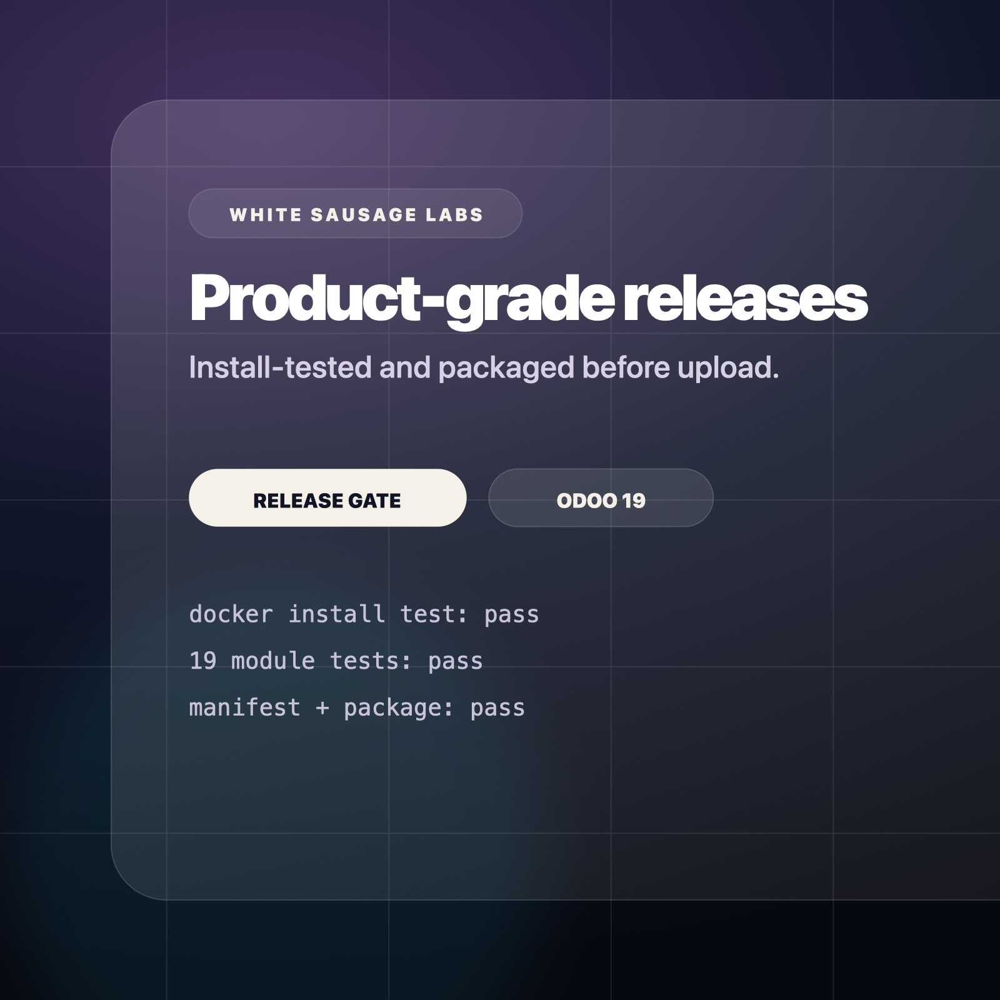
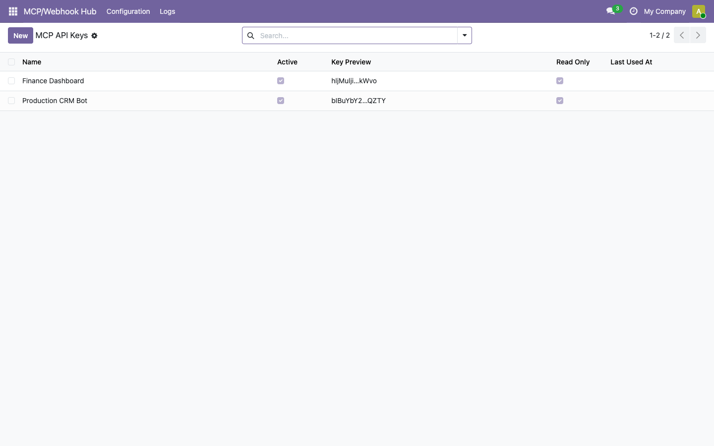
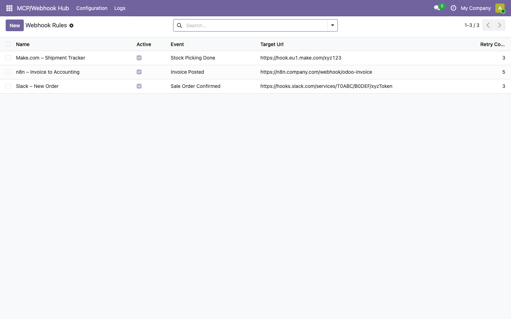
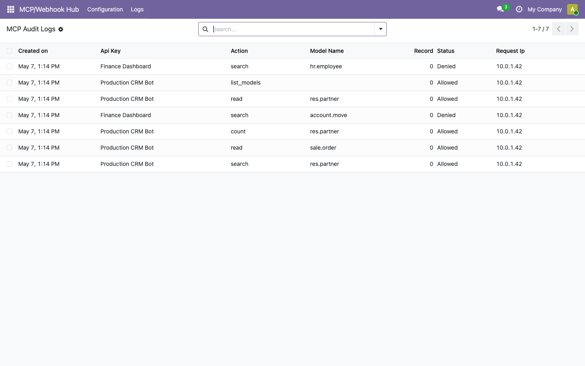
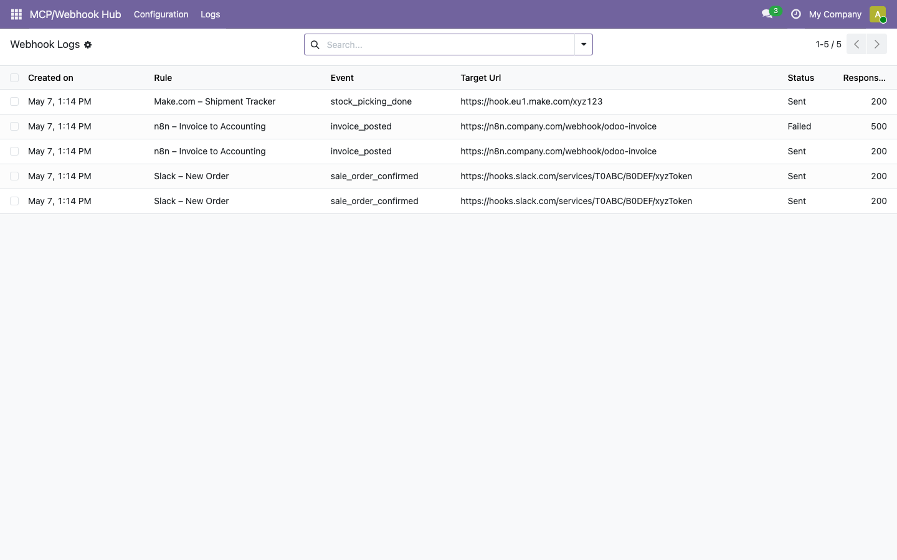

<p align="center">
  
</p>

<h1 align="center">MCP Webhook Hub for Odoo 19</h1>

<p align="center">
  <strong>Secure AI access and signed automation events for Odoo.</strong><br>
  A commercial Odoo app by <strong>White Sausage Labs</strong>, an independent software studio from Munich.
</p>

<p align="center">
  <a href="#product">Product</a> ·
  <a href="#security-model">Security</a> ·
  <a href="#screenshots">Screenshots</a> ·
  <a href="#release-quality">Release quality</a> ·
  <a href="#support">Support</a>
</p>

<p align="center">
  <a href="https://whitesausagelabs.com">Website</a> ·
  <a href="https://apps.odoo.com/apps/modules/19.0/gf_mcp_webhook_hub">Odoo Apps Store</a> ·
  <a href="mailto:support@whitesausagelabs.com">Support</a>
</p>

<p align="center">
  
</p>

---

## White Sausage Labs

White Sausage Labs builds focused software products for automation, AI infrastructure, and business systems.

The operating style is simple: clear scope, clean documentation, versioned releases, and production-minded defaults. The first product is an Odoo app for teams that want useful AI and workflow automation without handing broad write access to their ERP.

> This repository is the public product page and documentation repository.  
> The paid Odoo module is distributed through the Odoo Apps Store under the OPL-1 license.  
> The commercial module source code is not published here.

---

## Product

**MCP Webhook Hub** gives Odoo 19 a controlled automation layer for AI agents and external workflow tools.

It combines:

- a read-only MCP-style endpoint for controlled Odoo data access
- scoped API keys with model allowlists
- hashed token storage
- request audit logs
- signed outbound webhooks for business events
- delivery logs for webhook troubleshooting

The goal is not to expose all of Odoo. The goal is to expose the minimum useful surface area for safe automation.

---

## Security model

MCP Webhook Hub keeps v1 intentionally narrow.

| Area | Approach |
| --- | --- |
| MCP access | Read-only: `list_models`, `search`, `read`, `count` |
| Write operations | No create, write, unlink, or raw SQL endpoints in v1 |
| API keys | Bearer token or `api_key` parameter |
| Token storage | SHA-256 token hashes, not plain text tokens |
| Scope control | Explicit model allowlists per API key |
| Audit trail | Allowed, denied, and error requests are logged |
| Webhook signing | HMAC-SHA256 signature header |
| Delivery logs | Status, response code, response body, and retry context |

---

## Product visuals









---

## MCP endpoint

```http
POST /gf_mcp_webhook_hub/mcp
Authorization: Bearer <token>
Content-Type: application/json
```

Example request:

```json
{
  "action": "search",
  "model": "res.partner",
  "domain": [["is_company", "=", true]],
  "limit": 10
}
```

Supported actions:

| Action | Description |
| --- | --- |
| `list_models` | Lists models available to the API key |
| `search` | Searches records by Odoo domain and returns IDs |
| `read` | Reads selected fields from selected records |
| `count` | Counts records matching a domain |

---

## Webhook events

| Event | Trigger |
| --- | --- |
| `sale_order_confirmed` | Sale order is confirmed |
| `invoice_posted` | Invoice or credit note is posted |
| `stock_picking_done` | Delivery or receipt is validated |

Each outbound request includes:

```http
X-Odoo-Webhook-Signature: <hmac-sha256>
Content-Type: application/json
User-Agent: gf-mcp-webhook-hub/19.0
```

---

## Screenshots

### Scoped API keys



### Signed webhook rules



### MCP audit trail



### Webhook delivery logs



---

## Release quality

Each release is checked before packaging:

- manifest parses and uses OPL-1
- required Odoo Apps Store files exist
- static module checks pass
- Docker install test on Odoo 19 passes
- 19 module tests pass with 0 failures / 0 errors
- release ZIP is packaged with a clean module root

---

## Availability

Odoo Apps Store listing: pending publication. Planned listing URL: https://apps.odoo.com/apps/modules/19.0/gf_mcp_webhook_hub

## Support

Purchase-related support runs through the Odoo Apps Store messaging system or support@whitesausagelabs.com.

Support covers confirmed bugs in the purchased Odoo 19 version. It does not include custom development, migration to other Odoo versions, or third-party integration setup.

## License

The commercial Odoo module is licensed under **OPL-1**.

This public repository contains product documentation and public assets only. It does not contain the commercial Odoo module source code.
